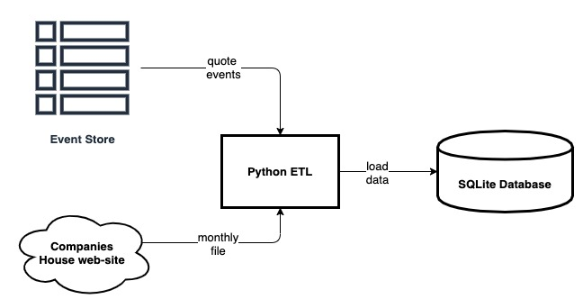

# quote-events-etl
ETL to extract and enrich quote events


## Overview

This repository contains the code to run the ETL to extract and load quote events and data used to 
enrich quotes data.



## Requirements

Code is developed in Python 3.7. Before running follow the steps below:

1- Set up and activate a Python 3.7 virtual environment
```
python3 -m venv /path/to/new/virtual/environment
source /path/to/new/virtual/environment/bin/activate
```

2 - Install required packages from the repository root
``
pip install -r requirements.txt
``

3 - Clone repository

4 - Edit the ``config.yaml`` file replacing the passwords


## Run the tests
From the root of the repository run ``pytest``


## Run the ETL
From the root of the repository run ``python3 quotes_etl.py config.yaml``
